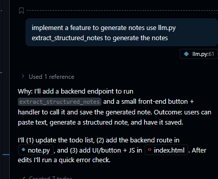

# A. Implement GenAI features in the notes taking app (Translation and Notes generation)

## 	1.Modify AI color (bg-indigo-500 AIcolor)

​	Vibe coding requires changing the background color to blue, and then you can manually select the desired color by locating the specific location. Finally, it was tested and verified to prove that the modification was successful.

## 	2.Add the ability to record date, time and tags in notes

​	Vibe coding requires adding tags, event date, and event time, and requires modifying the database first and then the front end. But after the first generation, I found that there was no tags input and time box, which was then fixed by vibe coding. 

And because the button layout is a bit inconsistent, I used the front-end F12 to find the names of the corresponding components and asked which ones were on the same line. Finally, it was tested and verified to prove that the modification was successful.

## 	3.Added the ability to sort the note lists on the left side of the page by dragging and dropping

​	This function is achieved by giving prompt words through vibe coding, as shown in the figure below. After testing, it was found that the dotenv library was not installed, and then it was installed through pip for verification. Finally, it was tested and verified to prove that the modification was successful.

## 	4. Add GenAI’s translation function

​	First, create a separate llm.py file. By using # characters, the Tab key, and the GPT4.1 API method retrieved from the GitHub model, we successfully call the API interface and use it for testing within this single file. After successful verification, the Copilot prompt prompts us to call this successfully verified method to implement the front-end and back-end translation functionality. Also, be sure to save the API key in the .env file during this step to prevent key leakage when syncing it to GitHub. Finally, it was tested and verified to prove that the modification was successful.

​	After this step, I found that there was only a "translate" option on the front end, but no language option, and the default translation was only English. I also found that after clicking it, only the content text was translated, and the title part was not translated, so I fixed it through copilot. Finally, it was tested and verified to prove that the modification was successful.

## 	5. Add note generation functionality	

​	Using a similar method, we first implemented the corresponding GenAI function in llm.py to extract tags and generate contents based on the title. After the test was completed, we implemented the function of generating notes through vibe coding requirements. 

​	During the test, it was found that there was no generation option on the page, and it was generated by default. At the same time, he reversed the generated content and mistakenly took the title as the thing to be generated. This was subsequently repaired using vibe coding. 

​	And later added the function of generating tags. Finally, it was tested and verified to prove that the modification was successful.

## 	6.Find bugs and fix them

​	I noticed that after editing the content, switching interfaces or creating a new note automatically saves the page, rendering the Save button useless. I also noticed that the newly added buttons also have AI colors. The date selection box uses a Chinese component and needs to be changed to a more general English date. Finally, it was tested and verified to prove that the modification was successful.

​	The above modifications are managed through git, as shown below

# B. Refactor the app to use Postgres in Supabase (Cloud database)

​	First, because modifying the database is a long and complex process, I chose to use the Claude Sonnet 4 model with a quota. Then, I asked it to provide me with a solution, as shown below.

​	I followed his plan, first downloading the necessary libraries and updating requirements.txt. I then registered on Superbase and set up a database. Initially, I asked him to refactor the app to use Postgres in Supabase (a cloud database), but during testing, I kept getting errors, similar to issues with API key string parsing. I then had him write a program to test the database connection, and it worked.

​	Later, after reading other materials, I found that it was because I did not write the table structure into Superbase, and Superbase cannot directly write the table structure through the API. Therefore, when the AI directly gave him the entire requirement, he did not remind me until I asked him to give me a plan later.

​	Then I asked it to help me change the part of the code from sqlite to superbase, and after testing, I found that it was able to connect successfully and write data successfully.

​	But then, while testing the database, I discovered bugs I'd missed before. First, the translation function only translated the title and content, but didn't update the tags. Also, the times in the note list on the left were all displayed as today, not according to the time selected in the note. The language selection box didn't have the most commonly used English option. And sometimes, when translating into other languages, the prompt words would be output and displayed.

​	These were all successfully resolved after vibe's instructions. One of the problems with tag translation was that the prompt specified that it should convert English to another language. This bug is also quite interesting. Finally, it was tested and verified to prove that the modification was successful.

​	The above modifications are managed through git, as shown below.

# C. Refactor the app and deploy the app in Vercel

​	Later, I registered a Vercel account and saw that I could directly import projects from GitHub repositories, so I tried it. It showed that if I wanted to import, the repository had to be public, otherwise I would have to pay. But when I checked my GitHub repository, I found that it was private. Then when I tried to change it to public, it told me that it was a fork of the teacher's class project and could not be edited. After searching online, I found a way to directly import this project into my own GitHub repository, but when I tried to import it, I kept getting errors, and after searching, I couldn't find a solution.

![1dbcd8be436b572fbc2b6db572668ac6](lab2_writeup/1dbcd8be436b572fbc2b6db572668ac6.png

​	Finally, I learned a way to clone the image through gpt5.0, so that I can save all my branches and commit information, and finally solve this problem.

​	Then I created the Vercel project and saved the .env key using Vercel's environment variable saving method.

​	However, an error still occurred during deployment. Finally, based on the error ID, I found the specific error information in the Vercel log. I then sent it to Copilot and found that it was a dependency compatibility issue. I finally modified it successfully and completed the deployment.

​	Finally, I discovered a new bug: when I clicked to create a new note, the tags and event time in the new note were still the same as the previous saved information. I successfully solved this with vibe coding.

​	It is worth mentioning that when I pushed git to github, I was still using the dev branch. I was planning to merge it and then update it to vercel. It turned out that it was bound. When I submitted the dev branch, it had already deployed my dev branch, which was very convenient for testing. This feature is still very good.

​	The above modifications are managed through git, as shown below. Finally, it was tested and verified to prove that the modification was successful.

